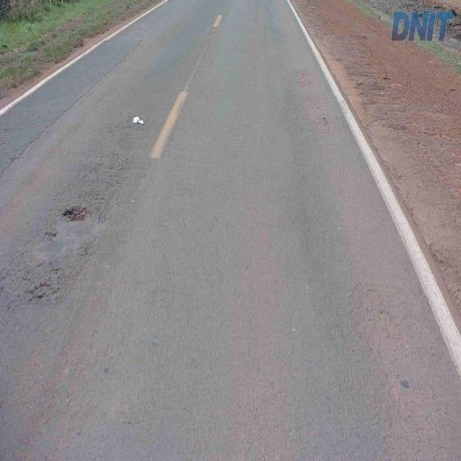
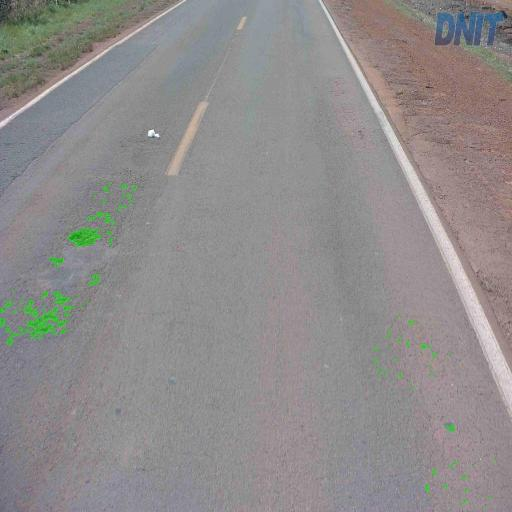

# **smart-arrotino**
Smart Arrotino: identifying anomalies from road images.

## **Dataset**
Smart Arrotino is trained on:
* Pothole (Segmentation):  [Cracks and Potholes in Road Images Dataset](https://github.com/biankatpas/Cracks-and-Potholes-in-Road-Images-Dataset) + [Kaggle Pothole](https://www.kaggle.com/datasets/sachinpatel21/pothole-image-dataset) (custom annotated) + photos taken around Italy
* Cracks (Segmentation): [Cracks and Potholes in Road Images Dataset](https://github.com/biankatpas/Cracks-and-Potholes-in-Road-Images-Dataset)


Input Image                |  Pothole Prediction
:-------------------------:|:-------------------------:
  |  


## **Important Information**
Currently only pothole segmentation is supported. You can download the dataset from [here](null).

## **Train**
Provide training configurations in the *config* folder with the yml file.

**[!!] Currently only single class prediction is implemented.**

If you are on CPU, please use the *default_cpu,yml* as skeleton for your configuration file. Otherwise use *default_gpu.yml*

Run the following command:
```
python3 train.py --config config/your_config.yml --data-dir /path/to/split/dataset --output-dir /path/to/output/folder
```

## **Inference**

Use the *notebooks/inference.ipynb* notebook:
* load the best trained model (ckpt file)
    ```
    model = RoadSegmentationModule.load_from_checkpoint(
        checkpoint_path="PATH/TO/BEST/CKPT"
    )
    ```
* set the input_size, the path to the split dataset, and the class your model predicts
    ```
    input_size = (512, 512)
    dataset = RoadDataset(
        data_dir="PATH/TO/SPLIT/DATASET",
        classes=["CLASS"],
        train=False,
        transform=transform(train=False, input_size=input_size)
    )
    ```

## **To-Do**
[ ] custom JaccardIndex for M1 devices

[ ] multi-label segmentation


