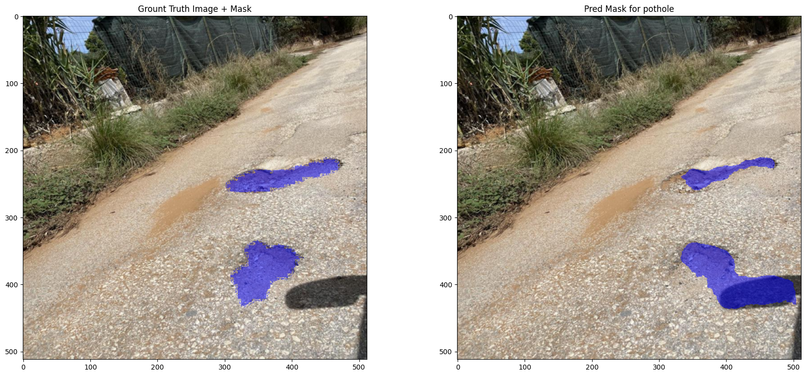
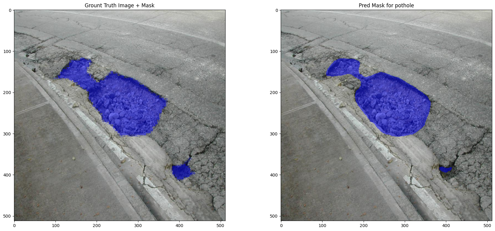
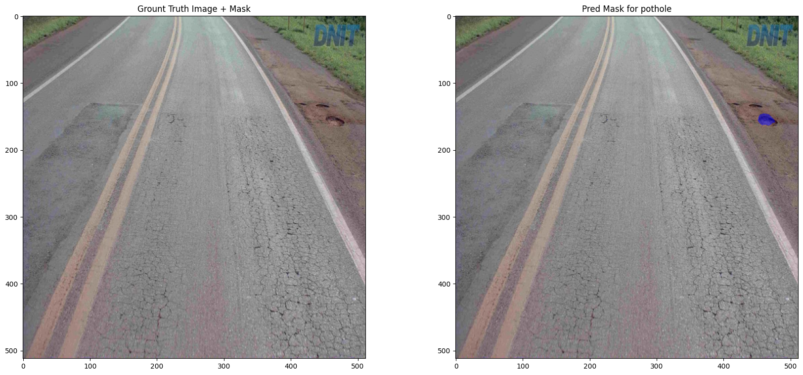
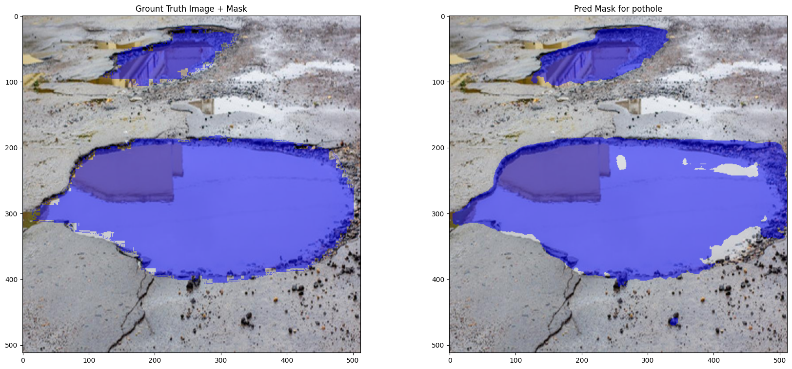
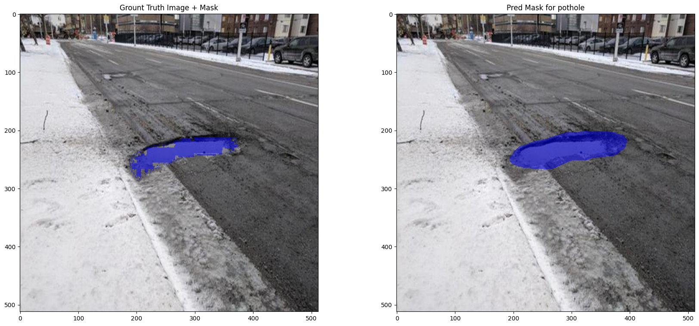

# **smart-arrotino**
smart-arrotino: identifying anomalies from road images.

<p align="center">
    
</p>

## **Dataset**
smart-arrotino is currently trained to identify potholes in road images via segmentation. 

The dataset is built upon different sources:
* [Cracks and Potholes in Road Images Dataset](https://github.com/biankatpas/Cracks-and-Potholes-in-Road-Images-Dataset)
* [Kaggle Pothole](https://www.kaggle.com/datasets/sachinpatel21/pothole-image-dataset)); 
* personal images taken around Italy and Belgium

Images coming from Kaggle Pothole and personal ones were annotated by myself with label-studio. 

You can download the dataset from this [link](https://drive.google.com/drive/folders/1M2c-3YwMeQMYtUnpk7z6xANJx63RIg8i?usp=sharing).

:warning: 
To receive approval to download the dataset please send an email to **riccardomusmeci92@gmail.com**, explaining why you want to use this dataset.

## **Model**
Currently, the only model trained is a Unet with a ResNet34 backbone. Use this [link](https://drive.google.com/drive/folders/189ZI2koM0FdEJTGbKRMwjrqX2LBiGMlp?usp=sharing) to download the model weights and the configuration file.

Here some results on validation images.

<p align="center">
    
</p>

<p align="center">
    
</p>

<p align="center">
    
</p>

<p align="center">
    
</p>

:warning:
Model is not perfect, here some things that need to be addressed:
* data quality and annotations to improve
* data heterogeneity to improve
* train different models to find the best one

## **Plot Inference Masks**
In the *notebooks* folder you can use the *inference-visualization.ipynb* notebook to plot some mask predicted by the model.

Before that, download the dataset and the weights from the links above and put the correct path in each cell.


## **Train**
To train your own model, you can specifiy your own config.yml file in *config* dir and run the *train.py* script with your own args.

```
python train.py --config config/YOUR_CONFIG.yml --output-dir PATH/TO/OUTPUT/DIR --data-dir PATH/TO/DATA/DIR
```

:warning:
Currently only num_classes=2 is supported.

## **To-Do**
[ ] dataset improvement


